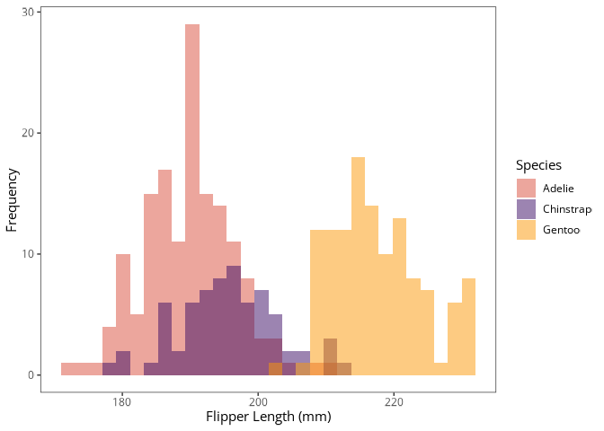

# brandr <a href = "https://danielvartan.github.io/brandr/"></a>

<!-- quarto render -->

<!-- badges: start -->
[](https://www.repostatus.org/#active)
[](https://cran.r-project.org/package=brandr)
[](https://doi.org/10.32614/CRAN.package.brandr)
[](https://cran.r-project.org/package=brandr)
[](https://github.com/danielvartan/brandr/actions)
[](https://app.codecov.io/gh/danielvartan/brandr)
[](https://www.gnu.org/licenses/gpl-3.0)
[](CODE_OF_CONDUCT.md)
<!-- badges: end -->

## Overview

`brandr` is an R package designed to facilitate brand identity
management using the [brand.yml](https://posit-dev.github.io/brand-yml/)
standard. It provides functions to consistently access and apply brand
colors, typography, and other visual elements across your R projects.

Unlike [Posit](https://posit.co/)’s
[`thematic`](https://rstudio.github.io/thematic/) package, `brandr`
offers more refined control over brand assets.

> If you find this project useful, please consider giving it a star!  
> [](https://github.com/danielvartan/brandr/)

> [!IMPORTANT]
> `brandr` is not affiliated with [Posit](https://posit.co/) or the developers of [brand.yml](https://posit-dev.github.io/brand-yml/).

## Installation

You can install the released version of `brandr` from
[CRAN](https://CRAN.R-project.org/package=brandr) with:

``` r
install.packages("brandr")
```

And the development version from [GitHub](https://github.com/) with:

``` r
# install.packages("remotes")
remotes::install_github("danielvartan/brandr")
```

## Usage

`brandr` is equipped with several functions to help you use your
`_brand.yml` file, like:

- [`color_brand_sequential()`](https://danielvartan.github.io/brandr/reference/color_brand_sequential.html),
  `color_brand_diverging()`, `color_brand_qualitative()`: Sequential,
  diverging, and qualitative brand color palettes
- [`scale_brand()`](https://danielvartan.github.io/brandr/reference/scale_brand.html),
  `scale_color_brand_d()`, `scale_color_brand_c()`,
  `scale_color_brand_b()`, `scale_fill_brand_d()`,
  `scale_fill_brand_c()`, `scale_fill_brand_b()`: Discrete, continuous,
  and binned brand color scales for
  [`ggplot2`](https://ggplot2.tidyverse.org/)
- [`get_brand_color()`](https://danielvartan.github.io/brandr/reference/get_brand_color.html):
  Get a brand color by name (e.g., primary)
- [`get_brand_color_tint()`](https://danielvartan.github.io/brandr/reference/get_brand_color_tint.html):
  Get a brand color tint
- [`get_brand_color_mix()`](https://danielvartan.github.io/brandr/reference/get_brand_color_mix.html):
  Get a mix of brand colors
- [`get_brand_font()`](https://danielvartan.github.io/brandr/reference/get_brand_font.html):
  Get a brand font by name (e.g., headings)

Example:

``` r
library(brandr)
library(ggplot2)
library(palmerpenguins)

penguins |>
  ggplot(aes(x = flipper_length_mm, fill = species)) +
    geom_histogram(alpha = 0.5, position = "identity") +
    scale_fill_brand_d() +
    labs(
      x = "Flipper Length (mm)",
      y = "Frequency",
      fill = "Species"
    )
```



Click [here](https://danielvartan.github.io/brandr/) to see the full
list.

## Configuration

### Path to `_brand.yml`

`brandr` will always look for a `_brand.yml` file in the root directory
of your project. If the file is not found, an error message will be
displayed. You can also set the path to the file manually using the
`options()` function:

``` r
options(BRANDR_BRAND_YML = "PATH_TO_BRAND.YML")
```

### Brand Color Scales

To control the colors of each brand color scale, assign
[hexadecimal](https://en.wikipedia.org/wiki/Web_colors) color codes in a
`character` vector to the following options:

- `BRANDR_COLOR_SEQUENTIAL`: For sequential color scales
- `BRANDR_COLOR_DIVERGING`: For diverging color scales
- `BRANDR_COLOR_QUALITATIVE`: For qualitative color scales

You can use `get_brand_color()` to get the hexadecimal color codes from
the `_brand.yml` file.

Example:

``` r
options(
 BRANDR_COLOR_SEQUENTIAL =
   get_brand_color(c("primary", "secondary")),
 BRANDR_COLOR_DIVERGING =
   get_brand_color(c("primary", "white", "secondary")),
 BRANDR_COLOR_QUALITATIVE =
   get_brand_color(c("primary", "secondary", "tertiary"))
)
```

## Setting Brand Fonts/Typefaces

`brandr` does not support custom fonts directly. We recommend using
Yixuan Qiu’s
[`showtext`](https://doi.org/10.32614/CRAN.package.showtext) R package
to apply custom fonts or typefaces to your plots.

Below is an example showing how to use the Google Font [Open
Sans](https://fonts.google.com/specimen/Open+Sans) in all of your plots
using [`ggplot2`](https://ggplot2.tidyverse.org/). This example assumes
that the font files are located in a `ttf` folder within your project
directory.

``` r
library(brandr)
library(ggplot2)
library(here)
library(sysfonts)
library(showtext)

font_paths(here("ttf"))

font_add(
  family = "open-sans",
  regular = here("ttf", "opensans-regular.ttf"),
  bold = here("ttf", "opensans-bold.ttf"),
  italic = here("ttf", "opensans-italic.ttf"),
  bolditalic = here("ttf", "opensans-bolditalic.ttf"),
  symbol = NULL
)

showtext_auto()

theme_set(
  theme(
    text = element_text(
      color = get_brand_color("black"),
      family = "open-sans",
      face = "plain"
    )
  )
)
```

## License

[](https://www.gnu.org/licenses/gpl-3.0)

``` text
Copyright (C) 2025 Daniel Vartanian

brandr is free software: you can redistribute it and/or modify it under the
terms of the GNU General Public License as published by the Free Software
Foundation, either version 3 of the License, or (at your option) any later
version.

This program is distributed in the hope that it will be useful, but WITHOUT ANY
WARRANTY; without even the implied warranty of MERCHANTABILITY or FITNESS FOR A
PARTICULAR PURPOSE. See the GNU General Public License for more details.

You should have received a copy of the GNU General Public License along with
this program. If not, see <https://www.gnu.org/licenses/>.
```

## Contributing

[](CODE_OF_CONDUCT.md)

Contributions are welcome! Whether you want to report bugs, suggest
features, or improve the code or documentation, your input is highly
valued. Please check the [issues
tab](https://github.com/danielvartan/brandr/issues) for existing issues
or to open a new one.

[](https://github.com/sponsors/danielvartan)

You can also support the development of `brandr` by becoming a sponsor.
Click [here](https://github.com/sponsors/danielvartan) to make a
donation. Please mention `brandr` in your donation message.

## Acknowledgments

`brandr` is not affiliated with [Posit](https://posit.co/) or the
developers of [brand.yml](https://posit-dev.github.io/brand-yml/).

`brandr` brand identity is based on
[brand.yml](https://posit-dev.github.io/brand-yml/) brand identity.
